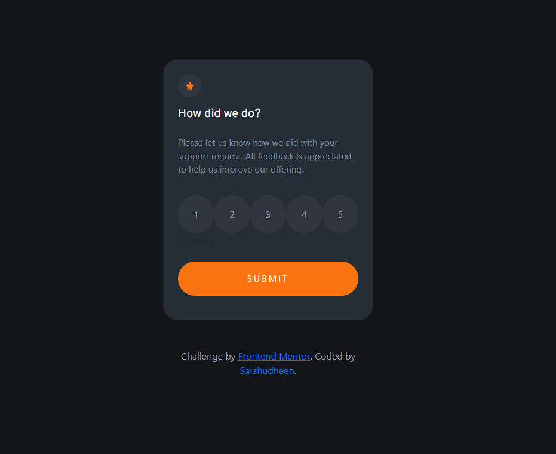

# Frontend Mentor - Interactive rating component solution

This is a solution to the [Interactive rating component challenge on Frontend Mentor](https://www.frontendmentor.io/challenges/interactive-rating-component-koxpeBUmI). Frontend Mentor challenges help you improve your coding skills by building realistic projects. 

## Table of contents

- [Overview](#overview)
  - [The challenge](#the-challenge)
  - [Screenshot](#screenshot)
  - [Links](#links)
- [My process](#my-process)
  - [Built with](#built-with)
- [Author](#author)

## Overview

### The challenge

Users should be able to:

- View the optimal layout for the app depending on their device's screen size
- See hover states for all interactive elements on the page
- Select and submit a number rating
- See the "Thank you" card state after submitting a rating

### Screenshot

### Links

- Solution URL: [GitHub](https://github.com/salahudheen007/interactive-rating-component-main)
- Live Site URL: [Live Site](https://634135010602f6035aa37036--rainbow-banoffee-5f2ac4.netlify.app/#)

## My process

- Semantic HTML5 markup
- CSS custom properties
- Flexbox
- CSS Grid
- Mobile-first workflow
- [Vite](https://vitejs.dev/) 
- [VueJs](https://vuejs.org/)

## Author

- Frontend Mentor - [@salahudheen007](https://www.frontendmentor.io/profile/salahudheen007)
- LinkedIn - [@salahudheen k](https://www.linkedin.com/in/salahudheen-k-7574ba1a6/)

